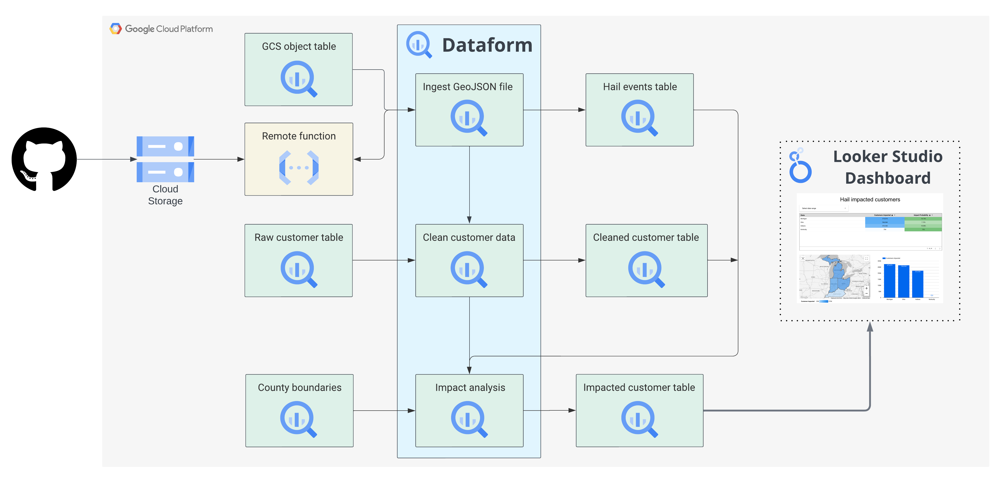

# Identifying hail-impacted customers - BigQuery GIS & Remote Functions demo

This repo provides an example of how BigQuery GIS and Remote Functions can be used to load GeoJSON files to BigQuery and determine which customers are potentially impacted by hail storms. The following instructions should help you get started.

Before you start: Though using a new GCP project for this example is not a requirement, it might be easiest to use a new GCP project for this. This makes cleanup much easier, as you can delete the whole project to ensure all assets are removed and it ensures no potential conflicts with existing resources. You can also remove resources by running `terraform destroy` after you deploy the resources

# Architecture Diagram
<p align="center">
  
</p>

# Deploying the infrastructure
## Setup
### 0. Clone this repo in Cloud Shell
#### 1. You'll need to set your Google Cloud project in Cloud Shell, clone this repo locally first, and set the working directory to this folder using the following commands.
```
gcloud config set project <PROJECT ID>
git clone https://github.com/shanecglass/hail_demo.git
cd hail_demo
```
#### 2. Enable the Cloud Resource Manager API
Check to make sure the [Cloud Resource Manager API](https://console.cloud.google.com/apis/library/cloudresourcemanager.googleapis.com) is enabled

### 1. Setup your infrastructure
This app uses Cloud Functions, BigQuery, Dataform, and more. Run the following to execute the Terraform script to setup everything.

#### 1. Intialize Terraform
First, initialize Terraform by running
```
terraform init
```

#### 2. Create the terraform.tfvars file and open it:
```
touch ./terraform.tfvars
nano ./terraform.tfvars
```

#### 3. Copy and paste the following code snippet.
Edit the values for the required variables, save the file, and exit.

```
# This is an example of the terraform.tfvars file.
# The values in this file must match the variable types declared in variables.tf.
# The values in this file override any defaults in variables.tf.

# ID of the project in which you want to deploy the solution
project_id = "PROJECT_ID"

# Google Cloud region where you want to deploy the solution
# Example: us-central1
region = "REGION"

# Whether or not to enable underlying apis in this solution.
# Example: true
enable_apis = true

# Whether or not to protect BigQuery resources from deletion when solution is modified or changed.
# Example: false
force_destroy = false

# Whether or not to protect Cloud Storage resources from deletion when solution is modified or changed.
# Example: false
deletion_protection = false
```
#### 4. Verify that the Terraform configuration has no errors
Run the following:
```
terraform validate
```
If the command returns any errors, make the required corrections in the configuration and then run the terraform validate command again. Repeat this step until the command returns `Success! The configuration is valid.`

#### 5. Review resources
Review the resources that are defined in the configuration:
```
terraform plan
```

#### 6. Deploy the Terraform script

```
terraform apply
```

When you're prompted to perform the actions, enter `yes`. Terraform displays messages showing the progress of the deployment.

If the deployment can't be completed, Terraform displays the errors that caused the failure. Review the error messages and update the configuration to fix the errors. Then run `terraform apply` command again. For help with troubleshooting Terraform errors, see [Errors when deploying the solution using Terraform](https://cloud.google.com/architecture/big-data-analytics/analytics-lakehouse#tf-deploy-errors).

After all the resources are created, Terraform displays the following message:
```
Apply complete!
```

The Terraform output also lists the following additional information that you'll need:
- A link to the Dataform repository that was created
- The link to open the BigQuery editor for some sample queries

## Setup your analysis workspace
### 2. **Configure Dataform**
#### 1. Create and initialize your Dataform workspace.
Click the Dataform link in the Terraform output to create a workspace, then click "initialize workspace" to get started.

#### 2. Update dataform.json
Update your Dataform Workspace's `dataform.json` file as described below:
```
{
  "defaultSchema": "hail_demo",
  "assertionSchema": "dataform_assertions",
  "warehouse": "bigquery",
  "defaultDatabase": "<YOUR PROJECT ID>",
  "defaultLocation": "us-central1"
}
```

#### 3. Add the definitions files to Dataform
Next, add the following files from the [definitions](./definitions/) folder to your Dataform workspace:
  - [load_geojson](./definitions/load_geojson.sqlx) - This calls the remote function created by the Terraform script to load the polygons defined in the GeoJSON file into BigQuery
  - [convert_customer_geog](./definitions/convert_customer_geog.sqlx) - This cleans the sample customer table and converts the `customer_geog` column to a GEOGRAPHY type. This might not be necessary if your customer data already has locations stored as GEOGRAPHY columns in BigQuery
  - [customers_impacted](./definitions/customers_impacted.sqlx) - This finds which customer locations fall within the hail polygon, indicating customers who were impacted by the storm

To add the files to your Workspace:
  - Remove the sample view files in your Datawork workspace's definitions folder.
  - Click the 3-dot menu next to your Dataform Workspace's definitions folder in the UI and select `Create file`
  - Name the file so it matches the examples provided and be sure to include the `.sqlx` extension. For example, the "Add a file path" field for the `load_geojson` file should read `definitions/load_geojson.sqlx`
  - Copy and paste the code from the file into the Dataform IDE.

Once the files are added, click `Start Execution` at the top of the Dataform IDE and select `All Actions` to run the full pipeline. Click the `Start Execution` button in the confirmation screen that pops up to run the workflow. You can see the status of your execution by clicking `Details` in the notification at the bottom of the screen, or clicking `Executions` at the top of the IDE

### 3. **Analyze your results!**
From here, click on the Looker Studio link in your Terraform outputs to start analyzing the data using a pre-built template. You can also head to the BigQuery console to see the table of the customers who were impacted by the hail event. If you need to see your Terraform outputs again, simply enter `terraform output` into your command line.
